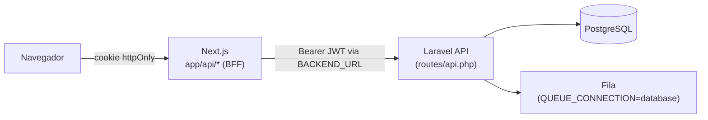

# Arquitetura

## Visão geral



O navegador nunca fala diretamente com o Laravel. Toda chamada passa pelo Next.js, que decide o que repassar e nunca expõe o token JWT a JavaScript no cliente (fica em cookie `httpOnly`).

O projeto modela dois contextos de acesso, replicados em ambas as camadas:

- **Admin** — área interna/administrativa (gestão de empresas, usuários, grupos, permissões);
- **Private** — mesmas funcionalidades, escopadas por empresa/usuário final.

## Backend

Cada requisição autenticada segue o mesmo fluxo em camadas:

```text
Route (routes/api.php)
   → Controller (app/Http/Controllers/{Admin,Private,Global,Lookup})
   → Form Request (validação em app/Http/Requests)
   → DTO (app/DTO) — normaliza os dados validados
   → Service (app/Services) — regra de negócio, transações, eventos
   → Model (app/Models) — persistência (Eloquent)
   → Resource (app/Http/Resources) — formata a resposta JSON
```

Os controllers também carregam atributos OpenAPI (`#[OA\Post(...)]` etc.) — a especificação Swagger vive junto do código, não em YAML separado.

### Estrutura de diretórios (`backend/app`)

```text
app/
├── Console/Commands/   # Comandos artisan customizados
├── Contracts/          # Interfaces de serviços externos (Cep, Email)
├── DTO/                # Um DTO por caso de uso
├── Enums/              # Status, tipos, códigos de erro
├── Events/ Listeners/  # Eventos de domínio e reações
├── Exceptions/         # Ex.: BusinessException
├── Http/
│   ├── Controllers/{Admin,Private,Global,Lookup}/
│   ├── Middleware/     # JwtMiddleware, SwaggerAdminAuth
│   ├── Requests/
│   └── Resources/
├── Jobs/
├── Models/
├── OpenApi/            # Schemas/respostas OpenAPI reutilizados
├── Providers/          # AuthServiceProvider (Gate::before)
├── Services/
│   └── External/       # Cep: BrasilAPI/ViaCEP · Email: SES/Mailtrap
└── Support/
```

Integrações externas (CEP, e-mail) ficam isoladas atrás de interfaces em `app/Contracts`, com implementação trocável via configuração (`EMAIL_PROVIDER`).

## Frontend (BFF)

O fluxo de autenticação/proxy:

1. A página chama uma rota interna em `app/api/auth/**` (ex.: `/api/auth/admin/login`);
2. Essa rota chama o Laravel via `BACKEND_URL` (variável só de servidor) e grava o JWT em cookie `httpOnly` (`admin_access_token` / `private_access_token`);
3. Chamadas seguintes passam por `app/api/proxy/{admin,private}`, que lê o cookie, injeta `Authorization: Bearer` e repassa a chamada;
4. `middleware.ts` intercepta a navegação e usa `routes/routes.ts` para redirecionar quando não há cookie válido (ou para o dashboard certo, se já autenticado).

### Estrutura de diretórios (`frontend/`)

```text
frontend/
├── app/
│   ├── admin/              # Páginas da área Admin
│   ├── (private)/          # Páginas da área Private (route group)
│   └── api/
│       ├── auth/           # Login/logout/2FA/refresh — grava os cookies httpOnly
│       └── proxy/          # Proxy autenticado para a API Laravel
├── domains/                # Dados por contexto/recurso: types, services, hooks, mappers
├── features/               # UI por contexto/recurso: components, schemas
├── components/             # ui (shadcn), layouts, data-tables, forms, feedback, providers
├── hooks/                  # Hooks compartilhados
├── lib/                    # Helpers de proxy, validações Zod
├── routes/routes.ts        # Mapa de rotas protegidas (consumido pelo middleware)
└── middleware.ts           # Proteção de rotas por cookie/JWT
```

Mais detalhes de cada pasta em [`frontend-arquitetura.md`](./frontend-arquitetura.md).
