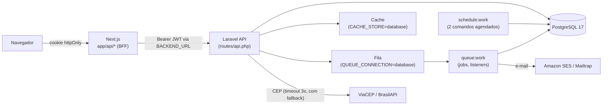

# Arquitetura

## Visão geral


```mermaid
flowchart LR
    Browser["Navegador"] -->|"cookie httpOnly"| BFF["Next.js\napp/api/* (BFF)"]
    BFF -->|"Bearer JWT via BACKEND_URL"| API["Laravel API\n(routes/api.php)"]
    API --> DB[("PostgreSQL 17")]
    API --> Cache["Cache\n(CACHE_STORE=database)"]
    API --> Queue["Fila\n(QUEUE_CONNECTION=database)"]
    Queue --> Worker["queue:work\n(jobs, listeners)"]
    Worker --> DB
    Sched["schedule:work\n(2 comandos agendados)"] --> DB
    API -->|"CEP (timeout 3s, com fallback)"| CEP["ViaCEP / BrasilAPI"]
    Worker -->|"e-mail"| Mail["Amazon SES / Mailtrap"]
```

O navegador nunca fala diretamente com o Laravel. Toda chamada passa pelo Next.js, que decide o que repassar. O JWT é gravado em cookie `httpOnly` (não acessível a JavaScript) e o BFF injeta o `Authorization: Bearer` nas chamadas ao backend. Observação: os handlers de login e 2FA também devolvem o objeto `data` do backend (que contém o campo `token`) no corpo da resposta — ver [`seguranca.md`](./seguranca.md#camada-bff-nextjs).

O projeto modela dois contextos de acesso, replicados em ambas as camadas:

- **Admin** — área interna/administrativa (gestão de empresas, usuários, grupos, permissões);
- **Private** — mesmas funcionalidades, escopadas por empresa/usuário final.

## Backend

Cada requisição autenticada segue o mesmo fluxo em camadas:

```text
Route (routes/api.php)
   → Controller (app/Http/Controllers/{Admin,Private,Global,Lookup})
   → Form Request (validação em app/Http/Requests)
   → DTO (app/DTO) — normaliza os dados validados
   → Service (app/Services) — regra de negócio, transações, eventos
   → Model (app/Models) — persistência (Eloquent)
   → Resource (app/Http/Resources) — formata a resposta JSON
```

Os controllers também carregam atributos OpenAPI (`#[OA\Post(...)]` etc.) — a especificação Swagger vive junto do código, não em YAML separado.

### Estrutura de diretórios (`backend/app`)

```text
app/
├── Console/Commands/   # Comandos artisan customizados
├── Contracts/          # Interfaces de serviços externos (Cep, Email)
├── DTO/                # Um DTO por caso de uso
├── Enums/              # Status, tipos, códigos de erro
├── Events/ Listeners/  # Eventos de domínio e reações
├── Exceptions/         # Ex.: BusinessException
├── Http/
│   ├── Controllers/{Admin,Private,Global,Lookup}/
│   ├── Middleware/     # JwtMiddleware, AudienciaMiddleware, AcessoSuporteMiddleware,
│   │                   # SecurityHeadersMiddleware, SwaggerAdminAuth
│   ├── Requests/
│   └── Resources/
├── Jobs/
├── Models/
├── OpenApi/            # Schemas/respostas OpenAPI reutilizados
├── Providers/          # AuthServiceProvider (Gate::before)
├── Services/
│   └── External/       # Cep: BrasilAPI/ViaCEP · Email: SES/Mailtrap
└── Support/
```

Integrações externas (CEP, e-mail) ficam isoladas atrás de interfaces em `app/Contracts`, com implementação trocável via configuração (`EMAIL_PROVIDER`).

## Frontend (BFF)

O fluxo de autenticação/proxy:

1. A página chama uma rota interna em `app/api/auth/**` (ex.: `/api/auth/admin/login`);
2. Essa rota valida a origem da requisição (`validarOrigem`), chama o Laravel via `BACKEND_URL` (variável só de servidor) e grava o JWT em cookie `httpOnly` (`admin_access_token` / `private_access_token`, validade de 1 hora);
3. Chamadas seguintes passam por `app/api/proxy/{admin,private}`, que valida a origem, resolve o destino com `lib/proxy-guard.ts` (só caminhos dentro de `BACKEND_URL`, métodos GET/POST/PUT/PATCH/DELETE e apenas o header `X-Acesso-Suporte-Id`), lê o cookie, injeta `Authorization: Bearer` e o IP do cliente validado (`lib/client-ip.ts`) e repassa a chamada;
4. `proxy.ts` (antigo `middleware.ts`) intercepta a navegação e usa `routes/routes.ts` para redirecionar quando não há cookie válido (ou para o dashboard certo, se já autenticado).

### Estrutura de diretórios (`frontend/`)

```text
frontend/
├── app/
│   ├── admin/              # Páginas da área Admin
│   ├── (private)/          # Páginas da área Private (route group)
│   └── api/
│       ├── auth/           # Login/logout/2FA/primeiro acesso/senha — grava os cookies httpOnly (não há handler de refresh)
│       └── proxy/          # Proxy autenticado para a API Laravel
├── domains/                # Dados por contexto/recurso: types, services, hooks, mappers
├── features/               # UI por contexto/recurso: components, schemas
├── components/             # ui (shadcn), layouts, data-tables, forms, feedback, providers
├── hooks/                  # Hooks compartilhados
├── lib/                    # Helpers de proxy (proxy-guard, client-ip, proxy-admin/private), validações Zod
├── routes/routes.ts        # Mapa de rotas protegidas (consumido pelo middleware)
└── proxy.ts                # Proteção de rotas por cookie/JWT (antigo middleware.ts)
```

Mais detalhes de cada pasta em [`frontend-arquitetura.md`](./frontend-arquitetura.md).

## Inventário (contagem em 2026-09-28)

| Item | Quantidade |
|---|---:|
| Rotas de API declaradas (`routes/api.php`) | 158 (64 GET, 35 POST, 13 PUT, 29 PATCH, 17 DELETE) |
| Controllers (Admin, Private, Global, Lookup) | 39 |
| Services / Models / Enums | 23 / 23 / 24 |
| Form Requests / Resources / DTOs | 77 / 86 / 62 |
| Migrations | 31 |
| Jobs / Events / Listeners | 2 / 8 / 7 |
| Comandos Artisan customizados | 4 (2 agendados) |
| Testes (Pest) | 153 (139 passam em 2026-10-01; 14 desatualizados) |
| Páginas Next.js (`page.tsx`) | 65 (40 Admin, 25 Private) |
| Route handlers do BFF | 18 (16 de auth + 2 de proxy) |
| Código PHP em `backend/app` | ~25 mil linhas |
| Código TS/TSX no frontend | ~50 mil linhas |

## Cache e armazenamento

- **Cache:** `CACHE_STORE=database` no `.env.example` (tabela `cache`). É usado para o cache de permissões por grupo/versão (`Usuario::permissoesCache()`), para os `temp_token` do 2FA, para o controle anti-replay de TOTP e para os contadores do rate limit. Há variáveis de Redis/Memcached no `.env.example`, mas nenhum uso de Redis foi identificado no código;
- **Arquivos:** todo upload passa por `FileStorageInterface` (provider escolhido por `FILE_STORAGE_DRIVER`: `local` por padrão, `s3` preparado). Anexos de chamado ficam no armazenamento privado e só são entregues por link assinado; o comando `chamados:mover-anexos-privados` migra anexos legados do público. Detalhes em [`armazenamento-de-arquivos.md`](./armazenamento-de-arquivos.md).
