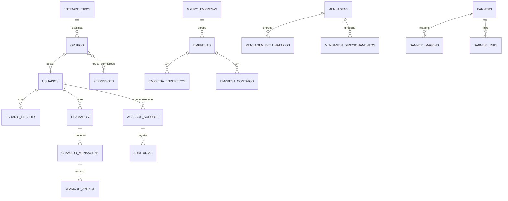

# Banco de dados

- **SGBD:** PostgreSQL 17, provisionado pelo `docker-compose.yml` do Sail (serviço `pgsql`).
- **Migrations:** 31 arquivos em `backend/database/migrations`, cobrindo tabelas de `cache` e `jobs` (fila/cache em banco), autenticação/sessões, grupos e permissões, empresas (com endereços e contatos), municípios, mensagens (com destinatários e direcionamentos), banners (com imagens e links), chamados de suporte (com mensagens e anexos), releases (novidades da plataforma), Acesso de Suporte e auditoria.
- **Seeders:** `backend/database/seeders`, organizados por contexto `Admin*` e `Private*`, populando tipos de entidade, permissões, grupos e dados de exemplo.

```bash
./vendor/bin/sail artisan migrate --seed
```

> O `AdminUsuarioSeeder` cria um usuário administrador de desenvolvimento (`admin@admin.com.br`, senha definida no próprio seeder). Use apenas em ambiente local — nunca rode esse seeder em produção sem revisar as credenciais.

## Modelos principais

| Model | Descrição |
|---|---|
| `Usuario` | Autenticável (JWT), com grupo, status, 2FA e soft delete |
| `Grupo` | Agrupamento de permissões; versão incrementada invalida cache de permissões |
| `Permissao` | Permissão individual (chave usada em `$this->authorize()`) |
| `Empresa`, `EmpresaEndereco`, `EmpresaContato` | Dados da empresa e seus relacionamentos |
| `GrupoEmpresa` | Vínculo entre grupo e empresa (contexto Private) |
| `Mensagem`, `MensagemDestinatario`, `MensagemDirecionamento` | Sistema de mensagens internas |
| `Banner`, `BannerImagem`, `BannerLink` | Campanhas de banner exibidas no Admin e no Private, com período, direcionamento (todos/entidade), múltiplas imagens e links |
| `Chamado`, `ChamadoMensagem`, `ChamadoAnexo` | Chamados de suporte (status, tipo, prioridade), conversa e anexos; `Chamado` não usa a trait `Auditavel` — o histórico já é mantido pela conversa em `ChamadoMensagem` |
| `Release` | Novidades da plataforma, publicadas pelo Admin e lidas pelo Private |
| `AcessoSuporte` | Concessão temporária, revogável e auditável de um Admin atuando no escopo de uma entidade concedente — ver [`autenticacao-e-autorizacao.md`](./autenticacao-e-autorizacao.md#acesso-de-suporte-impersonação-temporária-e-auditável) |
| `Auditoria` | Trilha de alterações (gravada de forma assíncrona); registros feitos em Acesso de Suporte carregam o `acesso_suporte_id` |
| `UsuarioSessao` | Sessões ativas, usadas pelo `JwtMiddleware` para revogação |
| `TokenResetSenha` | Tokens de redefinição de senha / primeiro acesso |
| `Municipio` | Base de municípios para lookup |

Todos usam UUID como chave primária (`HasUuids`).

## Auditoria

O trait `Auditavel` (`app/Auditoria/Auditavel.php`), aplicado a models como `Usuario`, registra alterações automaticamente, gravadas de forma assíncrona via `GravarAuditoriaJob` — veja [`filas-e-eventos.md`](./filas-e-eventos.md).

## Diagrama de relacionamentos (visão simplificada)



O diagrama é conceitual: mostra as relações principais, não todas as colunas nem todas as chaves estrangeiras. A fonte de verdade são as migrations.

## Índices e integridade (confirmados nas migrations)

- Chaves primárias UUID; `unique` em `usuarios.email`, `empresas.cnpj`, `chamados.ticket`, `tokens_reset_senha.token`, `permissoes.chave` e em pares como `(mensagem_id, usuario_id)`;
- `auditorias`: índices compostos `(entidade_tabela, entidade_id, criado_em)`, `(agrupador_tabela, agrupador_id, criado_em)` e `(usuario_id, criado_em)`, além de `(acesso_suporte_id, criado_em)`;
- `acessos_suporte`: índices por `(usuario_admin_id, status)`, `(usuario_concedente_id, status)`, `(entidade_tipo_id, entidade_id, status)` e por datas de criação;
- `chamados`: índices em `usuario_id`, `responsavel_id`, `status`, `prioridade`, `aberto_em`, `fechado_em` e `ultima_interacao_em`;
- `banners`: `banners_disponibilidade_index (status, inicio_em, fim_em)` e `banners_direcionamento_index (direcionamento_tipo, entidade_tipo_id)`; imagens e links indexados por `(banner_id, ordem)`;
- `mensagem_destinatarios`: índice `(usuario_id, lida_em)`; `grupos.versao` indexado (invalidação do cache de permissões);
- Soft delete em models como `Usuario` e `Banner` (o banner excluído pode ser restaurado via `PATCH /admin/banners/{id}/restaurar`).

## Consultas de leitura relevantes

O dashboard Admin (`DashboardService`) usa agregações no PostgreSQL (`AVG(EXTRACT(EPOCH ...))`, `date_trunc`, `GROUP BY`) sobre chamados e empresas; as buscas textuais usam `ILIKE`. Não foi identificado uso de *connection pooling* dedicado (PgBouncer) nem de réplicas de leitura.

## Seeders e dados iniciais

Seeders `Admin*` e `Private*` criam tipos de entidade, ~112 chaves de permissão (71 Admin + 41 Private, contagem por linhas `"chave"` nos seeders), grupos, usuários de desenvolvimento e municípios. O `MunicipioSeeder` popula a base usada pelo lookup.
